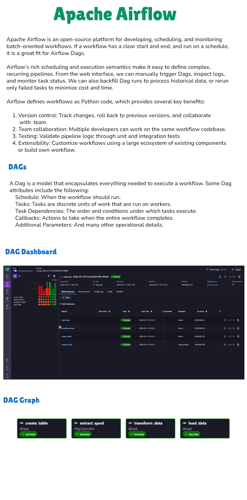

# 🚀 ETL Pipeline with Apache Airflow & NASA API

[](https://airflow.apache.org/)
[](https://www.postgresql.org/)
[](https://www.docker.com/)
[](https://aws.amazon.com/rds/)
[](https://www.astronomer.io/)

An end-to-end **ETL (Extract, Transform, Load)** pipeline built with **Apache Airflow**, orchestrated via the **Astronomer** platform. The pipeline fetches the NASA Astronomy Picture of the Day (APOD) via the NASA API, transforms the response data, and loads it into a **PostgreSQL** database — deployed both locally with Docker and in the cloud via **AWS RDS**.

---

## 📌 Project Overview

This project demonstrates a production-style ETL pipeline using Apache Airflow DAGs. It covers the full data engineering lifecycle:

- **Extract** — Fetch daily astronomy data from the [NASA APOD API](https://api.nasa.gov/)
- **Transform** — Parse and clean the API JSON response into structured fields
- **Load** — Insert the transformed records into a PostgreSQL table

The pipeline runs on a daily schedule (`@daily`) and is fully containerized for local development, with cloud deployment support via AWS RDS for PostgreSQL.

---

## 🏗️ Architecture

```
NASA APOD API
     │
     ▼
[Airflow DAG: nasa_apod_postgres]
     │
     ├── Task 1: create_table     → Creates `apod_data` table if not exists
     ├── Task 2: extract_apod     → Pulls APOD data via HttpOperator
     ├── Task 3: transform_data   → Parses title, explanation, url, date, media_type
     └── Task 4: load_data        → Inserts record into PostgreSQL via PostgresHook
```


---

## 🛠️ Tech Stack

| Tool / Technology | Role |
|---|---|
| Apache Airflow | Workflow orchestration |
| Astronomer | Airflow deployment & management |
| NASA APOD API | Data source |
| PostgreSQL | Data storage (local + cloud) |
| Docker / Docker Compose | Local containerized environment |
| AWS RDS (PostgreSQL) | Cloud database deployment |
| DBeaver | Database GUI client |

---

## 📁 Repository Structure

```
ETL_with_Airflow/
│
├── dags/
│   └── etl_pipeline.py       # Core Airflow DAG definition
│
├── Dockerfile                # Custom Airflow image
├── docker-compose.yaml       # Postgres container setup
├── requirements.txt          # Python dependencies
├── packages.txt              # System-level packages
├── .dockerignore
├── .gitignore
├── Airflow_pipeline.png      # DAG visualization screenshot
└── README.md
```

---

## ⚙️ DAG: `nasa_apod_postgres`

The DAG is defined in [`dags/etl_pipeline.py`](dags/etl_pipeline.py) and runs on a **daily schedule**. The task dependency chain is:

```
create_table >> extract_apod >> transform_data >> load_data
```

### PostgreSQL Schema

```sql
CREATE TABLE IF NOT EXISTS apod_data (
    id          SERIAL PRIMARY KEY,
    title       VARCHAR(255),
    explanation TEXT,
    url         TEXT,
    date        DATE,
    media_type  VARCHAR(50)
);
```

---

## 🚀 Getting Started

### Prerequisites

- [Docker Desktop](https://www.docker.com/products/docker-desktop/)
- [Astronomer CLI (`astro`)](https://docs.astronomer.io/astro/cli/install-cli)
- NASA API Key — Get one free at [https://api.nasa.gov/](https://api.nasa.gov/)
- (Optional) [DBeaver](https://dbeaver.io/) for database inspection

---

### 🐳 Local Setup (Docker + Astronomer)

1. **Clone the repository**
   ```bash
   git clone https://github.com/Somesh-Salunkhe/ETL_with_Airflow.git
   cd ETL_with_Airflow
   ```

2. **Start Airflow using Astronomer CLI**
   ```bash
   astro dev start
   ```
   This spins up the Airflow webserver, scheduler, triggerer, and a local PostgreSQL container via Docker.

3. **Access the Airflow UI**
   Open [http://localhost:8080](http://localhost:8080) in your browser.
   Default credentials: `admin` / `admin`

4. **Configure Airflow Connections**

   In the Airflow UI, navigate to **Admin → Connections** and add:

   - **NASA API Connection**
     - Conn ID: `nasa_api`
     - Conn Type: `HTTP`
     - Host: `https://api.nasa.gov`
     - Extra: `{"api_key": "<YOUR_NASA_API_KEY>"}`

   - **PostgreSQL Connection**
     - Conn ID: `my_postgres_connection`
     - Conn Type: `Postgres`
     - Host: `postgres` (for local) or your AWS RDS endpoint (for cloud)
     - Schema: `postgres`
     - Login: `postgres`
     - Password: `<your_password>`
     - Port: `5432`

5. **Trigger the DAG**
   Enable and trigger `nasa_apod_postgres` from the Airflow UI.

---

### ☁️ Cloud Setup (AWS RDS for PostgreSQL)

1. Create a **PostgreSQL** instance on [AWS RDS](https://aws.amazon.com/rds/).
2. Update the `my_postgres_connection` in Airflow with the RDS endpoint, username, and password.
3. Ensure the RDS security group allows inbound connections on port `5432` from your IP or Airflow instance.
4. Re-trigger the DAG — data will be loaded directly into the cloud database.

---

### 🗄️ Inspecting Data with DBeaver

1. Open [DBeaver](https://dbeaver.io/) and create a new **PostgreSQL** connection.
2. Use the same credentials as configured in the Airflow connection.
3. Navigate to `postgres → public → apod_data` to view the loaded records.

---

## 📦 Dependencies

Key Python packages used (see `requirements.txt` for full list):

- `apache-airflow-providers-http`
- `apache-airflow-providers-postgres`

---

## 📸 Pipeline Screenshot



---

## 📄 License

This project is open-source and available under the [MIT License](LICENSE).

---

## 🙋‍♂️ Author

**Somesh Salunkhe**  
[GitHub](https://github.com/Somesh-Salunkhe) | [LinkedIn](https://www.linkedin.com/in/somesh-salunkhe)
